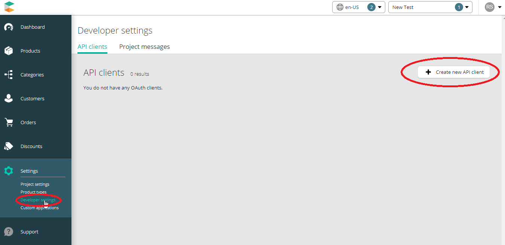
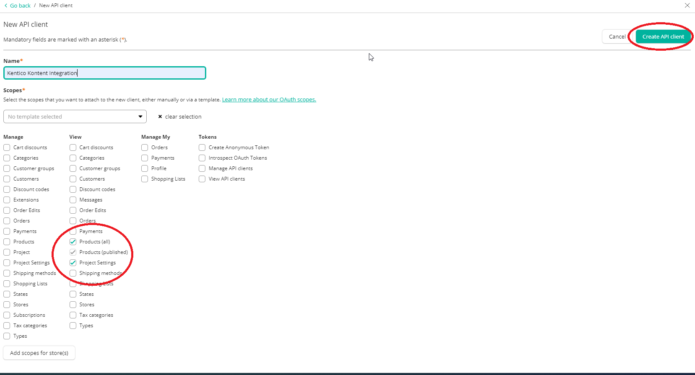
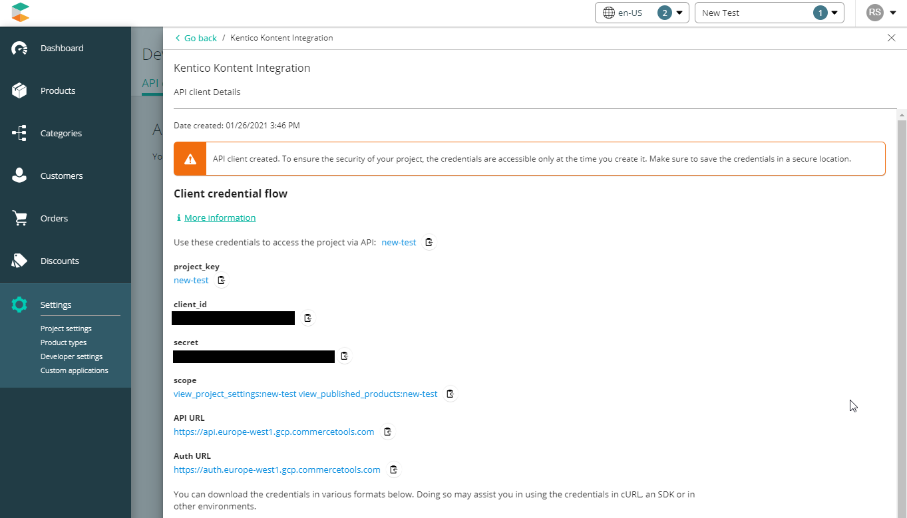
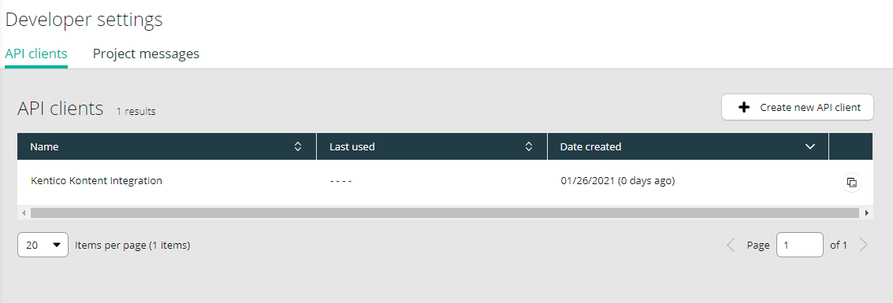

[![Core integration][core-shield]](https://kontent.ai/integrations/commercetools)
[![Gallery][gallery-shield]](https://kentico.github.io/kontent-custom-element-samples/gallery/)

![Last modified][last-commit]
[![Issues][issues-shield]][issues-url]
[![Contributors][contributors-shield]][contributors-url]
[![Forks][forks-shield]][forks-url]
[![MIT License][license-shield]][license-url]

[![Stack Overflow][stack-shield]](https://stackoverflow.com/tags/kentico-kontent)

<p align="center">
<image src="docs/01-kk-logo-main.svg" alt="kontent logo" width="300" />
<image src="docs/1.commercetools_primary-logo_horizontal_RGB.png" 
alt="commercetools logo" width="300">
</p>

<p align="center">
  <a href="#features">Features</a> •
  <a href="#demo">Demo</a> •
  <a href="#quick-deploy">Deploy</a> •
  <a href="#configuring-the-custom-element">Configuration</a> •
  <a href="#what-is-saved">Saved value</a> •
  <a href="#developing">Developing</a> •
  <a href="#contributors">Contributors</a> •
  <a href="#licence">Licence</a> •
  <a href="#additional-resources">Resources</a>
</p>

This [custom element](https://docs.kontent.ai/tutorials/develop-apps/integrate/integrating-your-own-content-editing-features) extension for [Kentico Kontent](https://kontent.ai) allows users to search and link selected products from [commercetools](https://commercetools.com) into their structured content.

## Features

- Editors can
  - Search for products in the commercetools project in all languages
  - Select a single product (or one of it's variants)
  - Select multiple products (or their variants)

The element also offers an optional debug panel for diagnostics.

## Demo

![Demo Animation][product-demo]

## Quick Deploy

Netlify has made this easy. If you click the deploy button below, it will guide you through the process of deploying it to Netlify and leave you with a copy of the repository in your account as well.

[](https://app.netlify.com/start/deploy?repository=https://github.com/Kentico/kontent-custom-element-commercetools)


## Commercetools setup
In order to use this custom element extension with your commercetools account, you'll need to setup the integration in your [Merchant Center](https://mc.commercetools.com/). 

### Adding a new API client
- The custom element will be connecting to your commercetools account and searching for products to include into your Kontent. In order to setup this communication, a new API client has to be created under **Settings** -> **Developer settings** -> **Create new API client**.



- Next, a dialog for your Kentico Kontent API client will be opened. Fill out the **Name** input field and under **Scopes** select **Products(all)** and **Project Settings** under the **View** category. This will give the extension a read-only access to your product list so it can be searched through while linking products to your content in Kentico Kontent. 
- After your scopes and client name has been put in, click the **Create API client** button in the top right of the screen.



- All of the important information you'll need to setup the custom element will be right in front of you. 



- Copy all of the generated credentials as these will be needed for the custom element setup that takes place inside of the Kentico Kontent application. The [following section](#configuring-the-custom-element) describes each of the generated settings and shows you, how to create the final configuration object for your element. 


> **⚠ WARNING: You won't be able to access the credentials screen once you close it.**
> Be sure to copy and place all of the generated credentials into your custom element configuration, otherwise, you'll be forced to re-create the API client. 




- Once you configure your custom element with the generated credentials, you can close the credentials window and confirm, that your API client has been successfully created.

## Configuring the Custom Element

You will need to add the custom element to a content type filling in the hosted code URL and the following JSON parameters:


| Name     | Type   | Description |
| -------- | ------ | ----------- |
| debug    | boolean | (Optional) If present and set to true the debug panel will activate when editing a content item. |
| multiSelect  | boolean | If set to true, it will be possible to select multiple products. If set to false, it will be possible to only select a single product |
| commercetools | object | This contains all the details required to connect to the [commercetools API](https://docs.commercetools.com/http-api). The values for this object will be derived from an API client that you configure in commercetools with the exception of the `defaultCulture`. When generating the API client, be sure to select the `view_products` and `view_project_settings` scopes. |
| commercetools.defaultCulture | string | Set this to the IETF language tag of the language in commercetools to use by default for search. |
| commercetools.projectKey | string | This is the commercetools project key. |
| commercetools.clientId | string | This is the commercetools API client ID. |
| commercetools.secret | string | This is the commercetools API client secret. |
| commercetools.oauthUrl | string | This is the base URL to use for authenticating with commercetools. |
| commercetools.apiUrl | string | This is the base URL to use for commercetools API calls. |
| commercetools.scope | string | This is the list of scopes that the client has. This should include the `view_products` and `view_project_settings` scopes. |

Sample parameters JSON:

```json
{
    "debug": true,
    "multiSelect": true,
    "commercetools": {
        "defaultCulture": "en",
        "projectKey": "your-project",
        "clientId": "your-client-id",
        "secret": "your-client-secret",
        "oauthUrl": "https://auth.sphere.io",
        "apiUrl": "https://api.sphere.io",
        "scope": "view_products:your-project view_project_settings:your-project"
    }
}
```

## What is Saved

The custom element will store the selected product's information in the following format:

```json
[{
  "id": "<GUID_OF_PRODUCT>",
  "variantId": "<Variant_ID>",
  "culture": "<IETF_LANGUAGE_TAG>"
}]
```

This value will be accessible though the [Kontent's Delivery API](https://docs.kontent.ai/reference/delivery-api) once the content item, containing the custom element, will be saved (through preview), or published (production).

## Developing

#### 

```bash
# Initial project setup
$ npm install

# Compile and hot-reload for development
$ npm run serve

# Compile and minifie for production
$ npm run build

# Lint and fix files
$ npm run lint
```


### Customize Vue CLI configuration

See [Vue CLI Configuration Reference](https://cli.vuejs.org/config/).


## Contributors
We have collected notes on how to contribute to this project in [CONTRIBUTING.md](CONTRIBUTING.md).

<a href="https://github.com/Kentico/kontent-custom-element-commercetools/graphs/contributors">
  
</a>

## License

[MIT](https://tldrlegal.com/license/mit-license)

## Additional Resources

- [Custom Element Gallery on github](https://kentico.github.io/kontent-custom-element-samples/gallery/)
- [Kentico Kontent's Integration documentation](https://docs.kontent.ai/tutorials/develop-apps/integrate/integrations-overview)
- [Custom Element documentation](https://docs.kontent.ai/tutorials/develop-apps/integrate/content-editing-extensions)
- [Custom Element API reference](https://docs.kontent.ai/reference/custom-elements-js-api)


[last-commit]: https://img.shields.io/github/last-commit/Kentico/kontent-custom-element-commercetools?style=for-the-badge
[contributors-shield]: https://img.shields.io/github/contributors/Kentico/kontent-custom-element-commercetools.svg?style=for-the-badge
[contributors-url]: https://github.com/Kentico/kontent-custom-element-commercetools/graphs/contributors
[forks-shield]: https://img.shields.io/github/forks/Kentico/kontent-custom-element-commercetools.svg?style=for-the-badge
[forks-url]: https://github.com/Kentico/kontent-custom-element-commercetools/network/members
[stars-shield]: https://img.shields.io/github/stars/Kentico/kontent-custom-element-commercetools.svg?style=for-the-badge
[stars-url]: https://github.com/Kentico/kontent-custom-element-commercetools/stargazers
[issues-shield]: https://img.shields.io/github/issues/Kentico/kontent-custom-element-commercetools.svg?style=for-the-badge
[issues-url]: https://github.com/Kentico/kontent-custom-element-commercetools/issues
[license-shield]: https://img.shields.io/github/license/Kentico/kontent-custom-element-commercetools.svg?style=for-the-badge
[license-url]: https://github.com/Kentico/kontent-custom-element-commercetools/blob/master/LICENSE
[core-shield]: https://img.shields.io/static/v1?label=&message=core%20integration&style=for-the-badge&color=FF5733
[gallery-shield]: https://img.shields.io/static/v1?label=&message=extension%20gallery&style=for-the-badge&color=51bce0
[stack-shield]: https://img.shields.io/badge/Stack%20Overflow-ASK%20NOW-FE7A16.svg?logo=stackoverflow&logoColor=white&style=for-the-badge
[product-demo]: docs/commercetools-demo.gif?raw=true